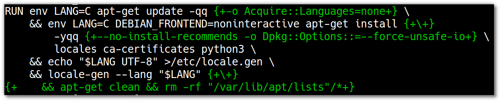

..  documentation: biopy3

    Copyright ©  2018 Jürgen Hermann <jh@web.de>

    Permission is hereby granted, free of charge, to any person obtaining a copy
    of this software and associated documentation files (the "Software"), to deal
    in the Software without restriction, including without limitation the rights
    to use, copy, modify, merge, publish, distribute, sublicense, and/or sell
    copies of the Software, and to permit persons to whom the Software is
    furnished to do so, subject to the following conditions:

    The above copyright notice and this permission notice shall be included in all
    copies or substantial portions of the Software.

    THE SOFTWARE IS PROVIDED "AS IS", WITHOUT WARRANTY OF ANY KIND, EXPRESS OR
    IMPLIED, INCLUDING BUT NOT LIMITED TO THE WARRANTIES OF MERCHANTABILITY,
    FITNESS FOR A PARTICULAR PURPOSE AND NONINFRINGEMENT. IN NO EVENT SHALL THE
    AUTHORS OR COPYRIGHT HOLDERS BE LIABLE FOR ANY CLAIM, DAMAGES OR OTHER
    LIABILITY, WHETHER IN AN ACTION OF CONTRACT, TORT OR OTHERWISE, ARISING FROM,
    OUT OF OR IN CONNECTION WITH THE SOFTWARE OR THE USE OR OTHER DEALINGS IN THE
    SOFTWARE.

    ~~~~~~~~~~~~~~~~~~~~~~~~~~~~~~~~~~~~~~~~~~~~~~~~~~~~~~~~~~~~~~~~~~~~~~~~~~~

=============================================================================
Python Base Images
=============================================================================

Official Docker Community Images
================================

The `Docker "Official Images"`_ for Python 3 based on ``debian:stretch-slim`` (55.3 MiB) are around 140 MiB in size.
Namely, ``python:3.6-slim-stretch`` comes in at 137.9 MiB,
while Python 3.7 is a little bigger at 142.7 MiB.
The ones based on Alpine have 74.2 MiB and 78.1 MiB.

The Dockerfiles and related sources for the images can be found at `docker-library/python`_.

.. _`Docker "Official Images"`: https://github.com/docker-library/official-images#docker-official-images
.. _`docker-library/python`: https://github.com/docker-library/python

.. _biopy3:

Ubuntu Bionic + Python 3
========================

Python 3.6 (Ubuntu default)
---------------------------

This shows how to create a Python 3 image based on *Ubuntu Bionic*. It
is roughly 55 MiB larger than the Alpine-based equivalent, but also
comes with runtime essentials like enabled locale, CA certificates, and
``glibc`` instead of the often problematic ``musl libc``.

The new ‘minimized’ Ubuntu images are a good base when you want to stay
in known waters, and your payload is not just a trivial script or
something equally simple. Alpine is a good choice for these small
payloads, which also often just have pure-Python dependencies, avoiding
most trouble with the different libc.

There is a simple and an optimized version of the Dockerfile, with a few
magic incantations added to the latter. To build both versions with
clean caches and timings for each build, use this:

.. code-block:: shell

    docker system prune --all --force
    ( cd biopy3 \
        && docker pull ubuntu:bionic \
        && time docker build -f Dockerfile.simple -t biopy3-simple . \
        && time docker build -f Dockerfile.optimized -t biopy3 . \
    )

Both images are built in about 15 seconds (on an Intel Core i7-6700 with
SSD storage). The ‘optimized’ one has a sub-second advantage regarding
build time. If you install more packages, the difference should get more
pronounced.

The image sizes show a much clearer picture: **129.6 MiB** for the
‘optimized’ version, and **176.5 MiB** for the ‘simple’ one.

   Differences between simple and optimized Dockerfile versions

Here are the objectives for each of the changes as shown above:

-  ``-o Acquire::Languages=none`` speeds up package list downloads by
   ignoring unneeded translation files.
-  ``--no-install-recommends`` limits the installed package set to what
   you listed explicitly, and hard dependencies of that list – e.g.
   ``nodejs`` will otherwise install a *full* Python 2.7 for no good
   reason, instead of just ``python-minimal``. That improves both build
   times and image size.
-  ``-o Dpkg::Options::=--force-unsafe-io`` switches off ``sync`` system
   calls during package expansion, speeding up package installation –
   since data is saved to a container layer shortly afterwards anyway,
   this is safe despite the option's name. ☺
-  ``apt-get clean && rm -rf "/var/lib/apt/lists"/*`` removes any cached
   packages and metadata *before* the layer is stored. Both are things
   that we simply do not need in an immutable container.
   While the APT ``clean`` is already baked into newer Debian base images,
   having an explicit cleanup call doesn't hurt either.

And the ``env LANG=C`` before the ``apt-get`` commands suppresses locale
initialization warnings since locales are not generated yet.

Python 3.7 (Deadsnakes PPA)
---------------------------

In ``biopy3/Dockerfile.deadsnakes`` the newest Python version is added,
as available from the Deadsnakes PPA.

Due to packaging mechanics, this gets installed in addition to Ubuntu's
default Python 3.6 – the resulting image size is 168.9 MiB (i.e. ~40 MiB more).
That means this is **not** a sensible option compared to images like ``python:3.7-slim-stretch``.
Also, timely security updates are not guaranteed for the PPA release channel.

Note that for the ``pip`` installation via ``get-pip.py``,
the command ``set -o pipefail`` is used to ensure the build fails if ``wget`` fails.
That in turn requires using the ``SHELL`` instruction to switch the default shell
from ``dash``, which does not implement ``set -o`` shell options,
to ``bash`` which supports that option.

.. code-block:: docker

    SHELL ["/bin/bash", "-c"]
    …
    RUN …
        && set -o pipefail \
        && wget -qO- https://bootstrap.pypa.io/get-pip.py | python3.7 \
        …

Python 3.7 (pyenv)
------------------

To build images for Python 3.7 and up, compiled and installed using `pyenv`_,
run these commands:

.. code-block:: shell

    command cd $(git rev-parse --show-toplevel)/biopy3
    pyversion=$(grep ARG.pyversion= Dockerfile.pyenv | cut -f2 -d= | cut -f1-2 -d.)
    pyenv_version=$(grep ARG.pyenv_version= Dockerfile.pyenv | cut -f2 -d=)
    wget https://github.com/pyenv/pyenv/archive/v${pyenv_version}.tar.gz
    ./make-pyenv-tk.sh >/dev/null

    declare -A base_images=( [biopyenv3]="ubuntu:bionic" [debpyenv3]="debian:stretch-slim" )
    for tag in "${!base_images[@]}"; do
        docker build --build-argument distro="${base_images[$tag]}" \
                     -t ${tag} -t ${tag}:$pyversion -f Dockerfile.pyenv .
        docker build --build-argument distro="${base_images[$tag]}" \
                     -t ${tag}-tk -t ${tag}-tk:$pyversion -f Dockerfile.pyenv-tk .
    done

See the comments at the start of ``Dockerfile.pyenv`` for some more details
and resulting image sizes.

.. _`pyenv`: https://github.com/pyenv/pyenv

.. admonition:: TODO

    Look at other options like Conda or PyRun.
